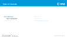
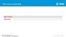
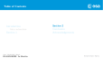
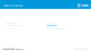
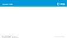
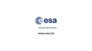

Beamer theme for ESA presentations based on the ESA powerpoint theme and icot/cern-beamer.

# Example presentation
[template.pdf](https://github.com/einoj/esa-beamer/blob/master/template.pdf)

# ESA Logo

ESA owns the copyright to the ESA logo, whic is available here:
[ESA Logo.](http://www.esa.int/esalogo/)
